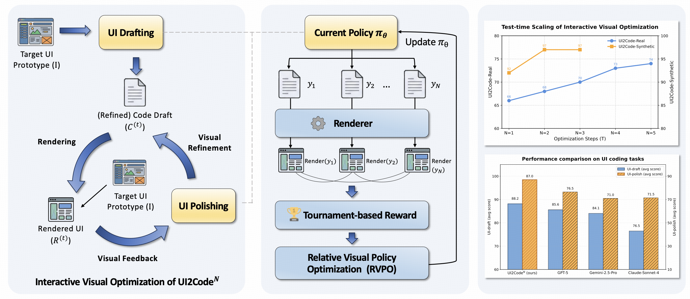
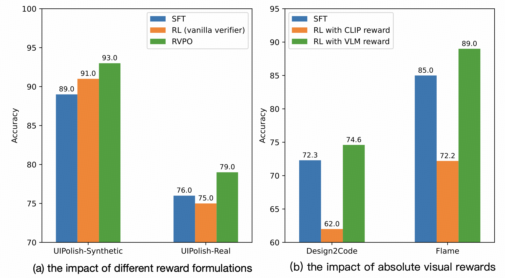

<h1>UI2Code^N: UI-to-Code Generation as Interactive Visual Optimization</h1>

<div align="center">
    <a href="https://huggingface.co/zai-org/UI2Code_N">🤗 Model</a> •
    <a href="https://arxiv.org/abs/2511.08195">📄 Paper</a> 
    • <a href="#demo">▶️ Demo</a>
    • <a href="https://zheny2751-dotcom.github.io/ui2code-n.github.io/">🌐 Website</a>
</div>
<div align="center">
  <strong> 🎉 Accepted to ICML 2026 </strong>
</div>

<br>

**UI2Code^N** reformulates UI-to-code as an **interactive visual optimization problem**. By embedding code generation in a closed-loop process of execution, visual inspection, and iterative refinement driven by rendered visual feedback, it more accurately reflects real-world UI development workflows. It unifies three key capabilities: **UI drafting**, **UI editing**, and **UI polishing**.

To address the non-differentiability of visual objectives and the noise of absolute visual evaluators, we propose **Relative Visual Policy Optimization (RVPO)**, a preference-based reinforcement learning method that optimizes relative visual rankings among rendered candidates under execution feedback.


<p align="center">
  
</p>


(**Left**) The VLM first performs **UI drafting** to generate an initial code draft $C^{(0)}$, which is rendered into $R^{(0)}$. Using visual feedback from the rendering, the same VLM iteratively performs **UI polishing** to produce refined code $C^{(t)}$. (**Middle**) **Relative Visual Policy Optimization (RVPO)**, the proposed reinforcement learning algorithm used to optimize both UI drafting and UI polishing. (**Right**) Performance consistently improves with additional refinement steps, highlighting the iterative nature of real-world UI development.

## Method Overview

UI2Code^N follows an interactive UI-to-code paradigm that fundamentally departs from prior single-turn generation approaches. We formalize this process as a feedback-driven transformation:

$$\mathcal{F}_{\theta}(I, C, R, E) \rightarrow C^{\prime}$$

where $I$ denotes the target UI image, $C$ the current code, $R = \text{Render}(C)$ the rendered output, $E$ optional modification instructions, and $C^{\prime}$ the updated code. The optimization objective is to find code $C^{*}$ that minimizes an implicit visual discrepancy $\mathcal{D}$:

$$C^{*} = \arg\min_{C} \mathcal{D}(I, \text{Render}(C))$$

<p align="center">
  
</p>

### 1. Instantiations of Visual Optimization
This interactive paradigm naturally unifies three key capabilities by defining how feedback and constraints are introduced:
* **UI Drafting:** Initializes the optimization process by producing a first-pass code approximation from the target UI screenshot: $C^{(0)} = \mathcal{F}_{\theta}(I)$.
* **UI Polishing (Visual Refinement):** Iteratively improves code quality by explicitly comparing the rendered execution feedback against the target UI. This enables test-time scaling: $C^{(t+1)} = \mathcal{F}_{\theta}(I, C^{(t)}, R^{(t)})$.
* **UI Editing:** Acts as a conditional variant of refinement where localized code updates are guided by explicit natural language modification instructions $E$: $C^{\prime} = \mathcal{F}_{\theta}(I, C, E)$.

### 2. Relative Visual Policy Optimization (RVPO)
The optimization objective is defined over rendered UI outcomes, which are non-differentiable. Furthermore, absolute visual scoring by VLM judges is often noisy. To address this, we optimize a rank-based surrogate objective measuring expected preference:

$$\mathcal{L}_{\text{rank}}(\theta) = \mathbb{E}_{y \sim \pi_{\theta}(\cdot|x)} \left[ \mathbb{E}_{y^{\prime} \sim \pi_{\theta}(\cdot|x)} [p_{\psi}(y > y^{\prime}|x)] \right]$$

* **Tournament-based Reward:** We sample $N$ candidates and perform pairwise comparisons. Each candidate $y_i$ is assigned a scalar reward based on its aggregate win count within the group: $W_i = \sum_{j \neq i} \mathbb{1}[\mathcal{C}_{\psi}(x, y_i, y_j) = 1]$.
* **Policy Optimization with GRPO:** We compute group-normalized advantages $A_i$ and update the policy using the clipped surrogate objective, ensuring stable learning under execution feedback.


## Table of Contents
- [Table of Contents](#table-of-contents)
- [Demo](#demo)
- [Model](#model)
- [Quick Start](#quick-start)
- [Evaluation](#evaluation)
- [Result](#result)
  - [Experimental results on UI-to-Code and UI Polishing benchmarks](#experimental-results-on-ui-to-code-and-ui-polishing-benchmarks)
  - [Reward Design](#reward-design)
- [Citation](#citation)

## Demo
We provide a ready-to-run demo script that deploys **UI2Code^N**, allowing users to experience interactive UI-to-code generation, editing, and polishing directly through a command-line or web-based interface.


### Web Interface Mode
```bash
cd demo
bash run_demo_web.sh
```
Once the web demo starts, open your browser and visit:
```bash
http://127.0.0.1:7860
```

### Command-Line Demo (Local Setup)

After downloading the model, run the following command to launch the demo::
```bash
cd demo
bash run_demo.sh
```

This demo will:

* Load pretrained checkpoints for UI2Code^N and initialize the visual-language pipeline.
* Accept a UI screenshot and a user prompt as input.
* Generate corresponding front-end code (e.g., HTML/CSS/React) with high fidelity to the visual layout.

🎬 A short demonstration is provided below, featuring UI-to-code generation, UI editing, and UI polishing. The demo highlights how UI2Code^N enables seamless transitions between these capabilities within a unified interactive workflow.

https://github.com/user-attachments/assets/3196a27d-3543-4029-9f36-429ec2acc7ff

UI2Code^N achieves performance comparable to leading closed-source models such as Claude-4-Sonnet and GPT-5.

## Model
UI2Code^N is built on `GLM-4.1V-9B-Base`, which is publicly available on [Hugging Face](https://huggingface.co/zai-org/UI2Code_N). 
Welcome to download and use it!

## Quick Start

First, please install the required dependencies using the following command:
```bash
apt-get install poppler-utils
pip install transformers==4.57.1 
# Optional
pip install vllm==0.10.2 sglang==0.5.2
pip install playwright
```
Then, run the following code:

```python
from transformers import AutoProcessor, AutoModelForImageTextToText
import torch

messages = [
    {
        "role": "user",
        "content": [
            {
                "type": "image",
                "url": "https://raw.githubusercontent.com/zheny2751-dotcom/UI2Code-N/main/assets/example.png"
            },
            {
                "type": "text",
                "text": "Who pretended to be Little Red Riding Hood's grandmother"
            }
        ],
    }
]
processor = AutoProcessor.from_pretrained("zai-org/UI2Code_N")
model = AutoModelForImageTextToText.from_pretrained(
    pretrained_model_name_or_path="zai-org/UI2Code_N",
    torch_dtype=torch.bfloat16,
    device_map="auto",
)
inputs = processor.apply_chat_template(
    messages,
    tokenize=True,
    add_generation_prompt=True,
    return_dict=True,
    return_tensors="pt"
).to(model.device)
generated_ids = model.generate(**inputs, max_new_tokens=16384)
output_text = processor.decode(generated_ids[0][inputs["input_ids"].shape[1]:], skip_special_tokens=False)
print(output_text)
```

## Evaluation

We provide evaluation scripts and test cases for both widely used benchmarks (Design2Code, Flame-React-Eva, Web2Code) and our constructed benchmarks (UI2Code-Real, UIPolish-Real, UIPolish-Synthetic). For detailed instructions on running the evaluations, please refer to the guide in [evaluation/readme.md](./evaluation/readme.md).

## Experimental Results

### Experimental results on UI-to-Code and UI Polishing benchmarks

[cite_start]UI2Code^N achieves state-of-the-art performance across UI-to-code generation, UI polishing, and UI editing benchmarks[cite: 70]. [cite_start]It consistently outperforms all open-source VLMs by a large margin and remains highly competitive with leading closed-source systems, including GPT-5, Gemini-2.5-Pro, and Claude-4-Sonnet.

### The Impact of Reward Design

[cite_start]To justify the effectiveness of Relative Visual Policy Optimization (RVPO), we conduct an ablation study comparing an absolute (vanilla) reward against the full RVPO reward based on tournament-style aggregation . [cite_start]For UI polishing, RVPO consistently outperforms both supervised fine-tuning (SFT) and reinforcement learning with a vanilla verifier[cite: 294]. [cite_start]For UI drafting, VLM-based absolute rewards provide consistent improvements over SFT, while CLIP-based rewards degrade performance, underscoring the sensitivity of UI drafting to proper reward design.


## Citation
If you find our model or code useful in your research, please cite our paper:
```
@article{ui2coden2025,
    title   = {UI2Code$^{N}$: A Visual Language Model for Test-Time Scalable Interactive UI-to-Code Generation},
    author  = {Yang, Zhen and Hong, Wenyi and Xu, Mingde and Fan, Xinyue and Wang, Weihan and Gu, Xiaotao and Tang, Jie},
    journal = {arXiv preprint arXiv:2511.08195},
    year    = {2025}
}
```
